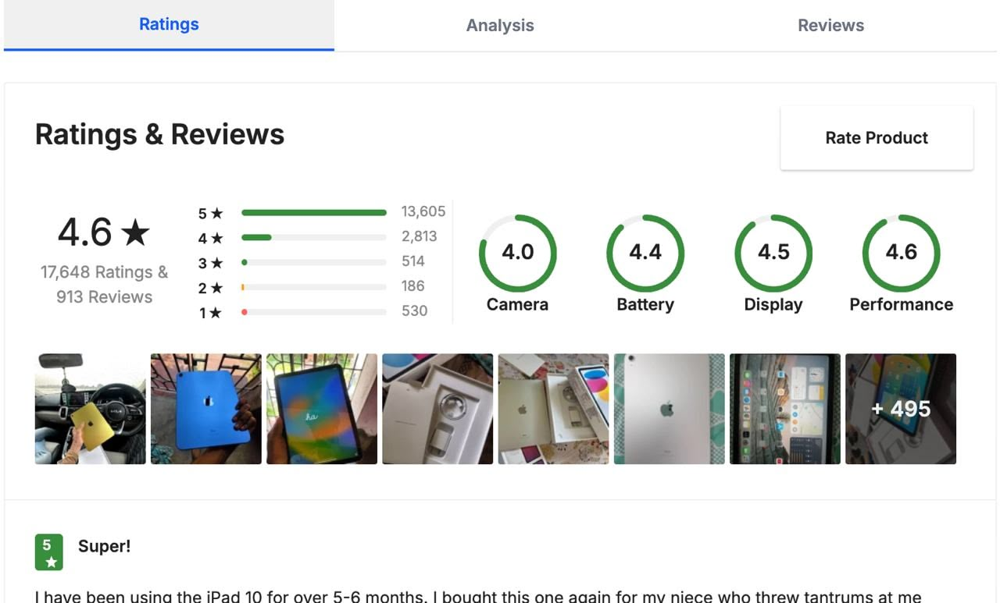

# Team Name: Generics

### Team Members

- Nishumbh Shah (TL)
- Siddharth Sahani
- Tejas Bhovad
- Pranavi Shukla

## Project Name: RevScan

- A chrome extension that allows users to make informed decisions about products by analyzing reviews and detecting AI-generated content.
- It provides a comprehensive analysis of reviews, including sentiment analysis, AI detection, and product ratings.
- The extension aims to enhance the online shopping experience by providing users with reliable information about products.

## Tech Stack

- **Chrome Extension**: The project is built as a Chrome extension, using WXT framework allowing users to access its features directly from their browser.
- **React**: The frontend is developed using React, providing a dynamic and responsive user interface.
- **Tailwind CSS**: The styling is done using Tailwind CSS, enabling rapid and efficient design.
